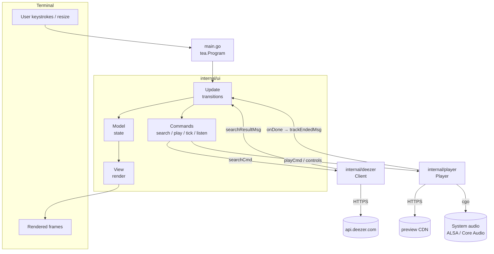
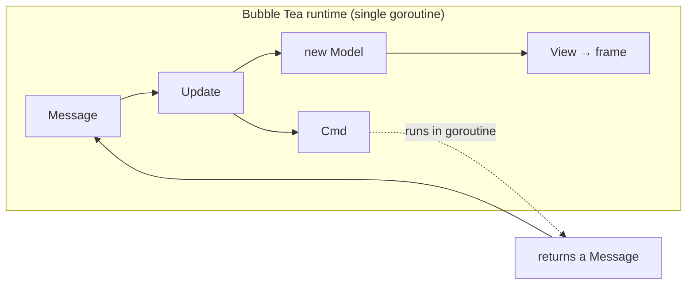
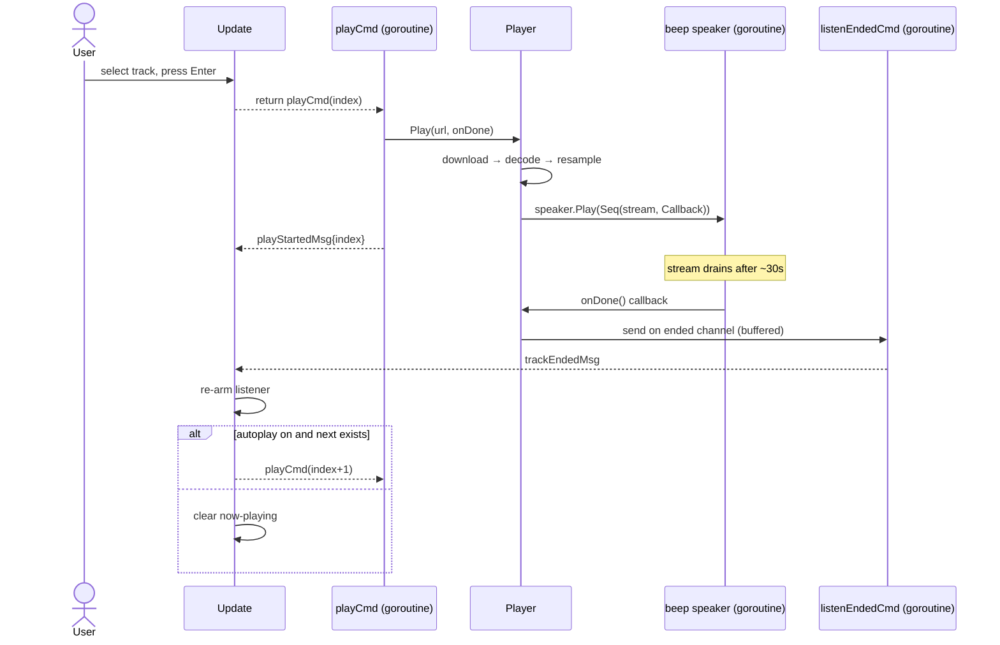
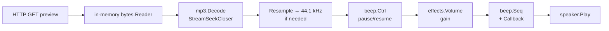

# Architecture

This document describes how AudioPulse is structured, how data and control flow
through it, and the concurrency and rendering models that hold it together.

## Contents

- [Overview](#overview)
- [Component model](#component-model)
- [Packages](#packages)
- [The Elm architecture in practice](#the-elm-architecture-in-practice)
- [Data flow: search](#data-flow-search)
- [Data flow: playback and autoplay](#data-flow-playback-and-autoplay)
- [Concurrency model](#concurrency-model)
- [Audio pipeline](#audio-pipeline)
- [Rendering and layout](#rendering-and-layout)
- [Error handling](#error-handling)
- [Extension points](#extension-points)

## Overview

AudioPulse is a single-binary terminal application. It follows the
**Model–Update–View** (Elm) architecture provided by Bubble Tea: all state lives
in one immutable-by-convention `Model`, state transitions happen in `Update` in
response to messages, and `View` is a pure function of state.

Three concerns are cleanly separated:

| Concern        | Package            | Responsibility                              |
| -------------- | ------------------ | ------------------------------------------- |
| Presentation   | `internal/ui`      | TUI model, input handling, rendering        |
| Catalogue data | `internal/deezer`  | Search the Deezer API                       |
| Audio          | `internal/player`  | Decode and play previews (or simulate them) |

The UI depends on the other two through small, well-defined interfaces and never
the reverse.

## Component model



## Packages

### `main`

The entry point. It constructs the root `Model` and runs a Bubble Tea program in
the alternate screen buffer:

```go
p := tea.NewProgram(ui.New(), tea.WithAltScreen())
p.Run()
```

### `internal/deezer`

A thin, dependency-free HTTP client for the public Deezer API. Its single method,
`Search(ctx, query)`, calls `GET /search`, decodes the JSON, and returns only
tracks that have a non-empty `preview` URL (so the UI never offers something it
cannot play). It is fully unit-testable and has an opt-in live integration test.

### `internal/player`

Owns audio output. It exposes one `Player` type with a stable method set
(`Play`, `TogglePause`, `Stop`, `Progress`, `HasTrack`, volume controls). There
are **two implementations selected at compile time** by build tags:

- `player_beep.go` (default) — real audio via `faiface/beep`.
- `player_silent.go` (`-tags nosound`) — a no-sound simulation.

Both files declare the same exported API, so the rest of the program is agnostic
to which is compiled in. See [ADR-0004](adr/0004-build-tag-fallback-strategy.md).

### `internal/ui`

The bulk of the application, split by responsibility:

| File         | Responsibility                                                    |
| ------------ | ----------------------------------------------------------------- |
| `model.go`   | `Model` struct, message types, commands, and helpers              |
| `update.go`  | `Update` — the message → state-transition function                |
| `view.go`    | `View` and all rendering/layout logic                             |
| `styles.go`  | The Lip Gloss style palette (the Spotify-green theme)             |

## The Elm architecture in practice



- **Model** is the single source of truth: window size, the text input, the
  results slice, the cursor, focus, and playback state (`playing` index,
  `paused`, `elapsed`, `total`, `volume`, `autoplay`).
- **Update** is the only place state changes. It is a large type switch over
  message types and returns the next model plus an optional command.
- **Commands** (`tea.Cmd`) are functions the runtime executes off the main loop;
  each returns a message that re-enters `Update`. This is how all I/O — HTTP,
  audio, timers — stays off the render path.
- **View** is pure: given a model it returns a string. It performs no I/O and
  mutates nothing observable.

### Messages

| Message            | Produced by            | Effect in `Update`                           |
| ------------------ | ---------------------- | -------------------------------------------- |
| `tea.WindowSizeMsg`| runtime (on resize)    | Store dimensions; size the input             |
| `tea.KeyMsg`       | runtime (on key)       | Dispatch to focus-specific handler           |
| `searchResultMsg`  | `searchCmd`            | Populate results or surface an error         |
| `playStartedMsg`   | `playCmd`              | Mark the now-playing track or surface error  |
| `trackEndedMsg`    | `listenEndedCmd`       | Re-arm the listener; autoplay the next track |
| `tickMsg`          | `tickCmd` (2 Hz)       | Refresh progress and pause state             |

## Data flow: search

```mermaid
sequenceDiagram
    actor User
    participant UI as Update
    participant Cmd as searchCmd (goroutine)
    participant DZ as deezer.Client
    participant API as api.deezer.com

    User->>UI: type query, press Enter
    UI->>UI: searching = true
    UI-->>Cmd: return searchCmd(query)
    Cmd->>DZ: Search(ctx, query)
    DZ->>API: GET /search?q=…&limit=50
    API-->>DZ: JSON tracks
    DZ->>DZ: filter to previewable tracks
    DZ-->>Cmd: []Track
    Cmd-->>UI: searchResultMsg{tracks}
    UI->>UI: results = tracks; focus = results
```

The HTTP call has a 15-second context timeout and never blocks the UI thread.

## Data flow: playback and autoplay

Playback is the most concurrency-sensitive path because audio completion is
signalled from a different goroutine than the one driving the UI. AudioPulse
bridges the two with a buffered channel and a long-lived "listener" command.



`Init` starts the `listenEndedCmd` once; every `trackEndedMsg` re-issues it, so
exactly one listener is blocked on the channel at any time. The channel is
buffered (capacity 1) and the `onDone` send is non-blocking, so a completion
signal is never lost nor able to stall the speaker goroutine.

## Concurrency model

AudioPulse has four kinds of goroutines:

1. **The Bubble Tea runtime loop** — runs `Update` and `View`. All model state is
   confined here; nothing else touches the `Model`.
2. **Command goroutines** — short-lived; perform I/O (HTTP, kicking off playback)
   and return a single message. They never touch the `Model` directly.
3. **The beep speaker goroutine** — owned by `faiface/beep`; mixes and writes
   audio. It invokes the `onDone` callback when a stream finishes.
4. **The listener goroutine** — `listenEndedCmd`, blocked on the `ended` channel,
   translating audio completion into a UI message.

### Player locking and lock ordering

The `Player` guards its own fields with `Player.mu`. Some operations also need
beep's global mixer lock via `speaker.Lock()/Unlock()`.

> **Invariant:** acquire `Player.mu` **before** `speaker.Lock()`, never the
> reverse. The `onDone` callback runs while beep holds its mixer lock, so it must
> not attempt to take `Player.mu`; instead it only performs a non-blocking
> channel send. This ordering prevents deadlock between the UI-driven control
> methods and the speaker goroutine.

This rule is part of the contract for anyone modifying `internal/player`.

## Audio pipeline

The beep backend builds a small streaming graph per track:



Design choices:

- **Buffer fully in memory.** Previews are ~30 s (a few hundred KB), so each is
  downloaded into a seekable `bytes.Reader`. This makes MP3 decoding robust and
  yields an accurate length for the progress bar.
- **Resample only when needed.** The speaker is initialised once at 44.1 kHz;
  sources at other rates are wrapped in a resampler.
- **Position tracking.** Progress is read from the underlying
  `StreamSeekCloser`'s `Position()`/`Len()` (in source-rate samples) and
  converted to wall-clock time via the source format's sample rate — consistent
  even when resampling.
- **Completion.** `beep.Seq(stream, beep.Callback(...))` fires the callback when
  the stream drains naturally; stopping or replacing a track clears the speaker
  first, so the callback does not fire on manual stop.

The silent backend mirrors the same external behaviour using wall-clock timing
and a monitor goroutine, with no decoding or device access.

## Rendering and layout

`View` composes the frame top-to-bottom with Lip Gloss:

```
title (1 row)
┌ sidebar ┐┌ main ───────────┐    ← JoinHorizontal
└─────────┘└─────────────────┘
┌ now-playing bar ───────────┐
└────────────────────────────┘
help (1 row)
```

A single helper, `panelDims`, translates a desired **outer** size into the
values fed to a bordered style. This matters because of Lip Gloss semantics:

> `Style.Width(n)` / `Style.Height(n)` set the **padding + content** box; the
> border is drawn **outside** that. So to achieve an exact outer size, subtract
> only the border for the style dimensions, and subtract the full frame
> (border + padding) to get the inner text width used for truncation/wrapping.

The results list is **windowed** around the cursor so the selection stays visible
without scrollback, and long titles are truncated to the available text width.
Below a minimum terminal size (64×18) the UI renders a resize prompt instead of a
broken layout.

The colour palette (Spotify green `#1DB954` accent on a dark ground) is defined
once in `styles.go`; see [ADR-0002 note on theming](adr/) and the
[Configuration](configuration.md#theme) guide.

## Error handling

- **Network/search errors** are returned to `Update` via `searchResultMsg.err`,
  shown inline in the status line, and never crash the program.
- **Playback errors** (download, decode, or audio-init failure) arrive via
  `playStartedMsg.err` and are surfaced the same way. Crucially, audio
  initialisation is **lazy** (on first play) and its failure is non-fatal — the
  UI keeps working without sound.
- **Decode errors** on malformed audio are handled, not panicked.

## Extension points

The seams designed for extension:

- **Alternative catalogues.** `internal/deezer` could be generalised behind a
  `Catalogue` interface (`Search(ctx, q) ([]Track, error)`); the UI already
  depends only on the returned `Track` shape.
- **Alternative audio sources.** The `Player` API is source-agnostic — it takes a
  preview URL. Full-track playback (local files, Spotify Web API) would slot in
  behind the same methods. See
  [ADR-0002](adr/0002-deezer-as-data-source.md).
- **New backends.** Additional `player_*.go` implementations can be added behind
  build tags without touching the UI.
